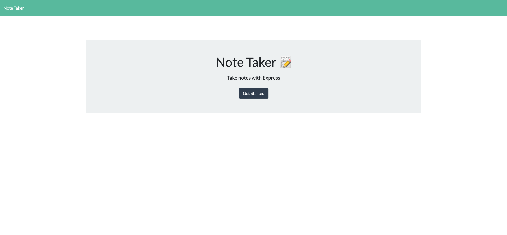
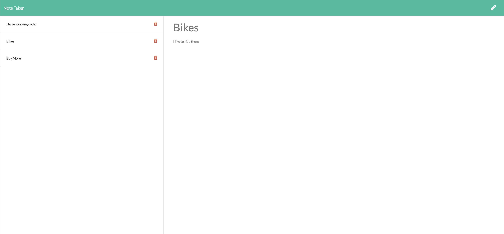
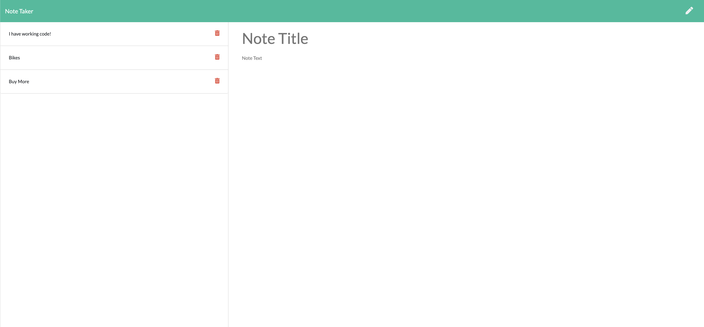

# business-notes

## About

This note taker will store user generated notes in a json file using an express.js server.  The stored notes then can be viewed or deleted.

## Table of Contents

- [Files](#Files)
- [Usage](#Usage)
- [Contributions](#Contributions)
- [Testing](#Testing)
- [Credits](#Credits)
- [License](#License)
- [Contact](#Contact)

## Files

- index.html
- README.md
- LICENSE
- package.json
- (db)
  - db.json
- (public)
  - index.html
  - notes.html
  - (assets)
    - (css)
    - (js)
- (routes)
  - apiRoutes.js
  - htmlRoutes.js
- (screenshots)

## Usage

Deployed project can be found at [business-notes](https://arcane-earth-85867.herokuapp.com/)

After navigating to the application, you will be greeted with a landing page.  Clicking on the link to the notes page will present you with existing notes in the left column, and empty fields to enter new notes on the right.  After entering both a title and text to a note, a save icon will appear allowing the note to be saved.  The new note will appear in the left hand column.  Clicking on a note in the left hand column, the title and text will apear in the right hand column.  When the Write icon is clicked, empty fields for new note title and text appear in the right hand column.

## Contributions

Contributions can be made by forking the repository on gitHub and submitting a pull request.

The repository can be found at [command-manager](https://github.com/jacob-af/business-notes)

## Testing

No testing suites were used in this project.

## Credits

The contents of the public folder were provided and only slightly modified to fix a small error.  The server and routes were developed by Jacob A. Feitler

## License:

This project is licensed under the MIT license, copyright 2021

## Contact

You can view my GitHub profile at [github.com/jacob-af](https://github.com/jacob-af)